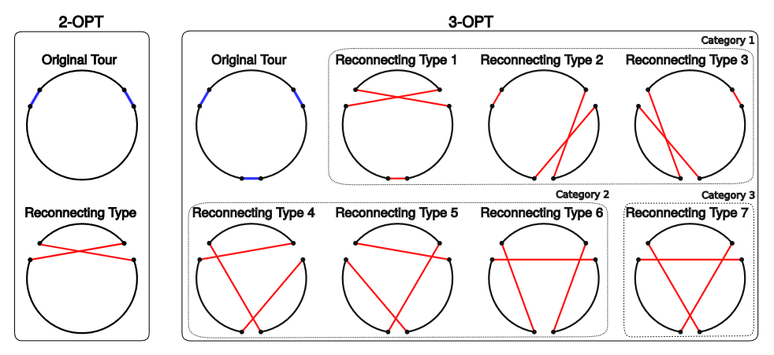

# Heuristic Algorithms for Approximating the Traveling Salesman Problem
This program will approximate the Traveling salesman problem using 3 three different algorithms (Nearest Neighbot, 2Opt, and 3Opt). There are size different combinations and explanations for these can be found in the sections below. The program allows you to run each algorithm individually or run a benchmark for all 6 and the original unoptimized list. The results are formatted in a table and displayed in the console. As the algorithms have different time complexities, the time it takes increases for some algorithms drastically, so use caution when using many places. 

## What are some TSP heuristic algorithms?
The Traveling Salesman Problem finds the shortest path to tour a group of destinations. This is the same as finding the shortest Hamiltonian cycle in a graph that has O(n!) complexity. This is not feasible for large values of n. For example, a tour with 99 destinations has around 9e+155 or 2^519 possible solutions if you explore the entire solution space to find the optimal solution.

Heuristic algorithms allow us to find solutions that are near the optimal solution quickly. This optimization is typically done in two phases: construction and improvement.

The Nearest Neighbor algorithm is a greedy construction algorithm that creates a solution by always selecting the closest unvisited city to visit next until all of the cities are visited. This algorithm constructs a new tour starting from each city since they will not be identical and saves only the best tour that it finds. For each tour constructed from a starting city, the algorithm repeatedly finds the closest remaining city to the last city visited and adds that to the tour until all cities have been visited. When comparing tour distances, we consider the round trip distance that includes returning to the starting city. The nested loops make this an O(n^3) algorithm, where n is the number of destinations. Here is the psuedocode for Nearest Neighbor:
```
nearestNeighborWithOptimization(cities) {
   for each starting city (as time permits)
      add the starting city to the tour and remove from the list of unvisited cities
      while there are unvisited cities remaining
         from the last city in the tour add the nearest unvisited city to the tour 
      improve the tour with 2-opt or 3-opt (if time permits)
   return the tour with the shortest distance
}
```

The 2-opt or 3-opt algorithms can often improve the greedy solution created by the nearest neighbor algorithms. They can also be used by themselves.
- 2-opt is an improvement algorithm the reverses segments within a solution to reduce the total distance traveled until no further improvements can be made. The algorithm evaluates all of the possible reversals for improvement and restarts each time an improvement is made. This makes the algorithm slightly more than O(n^3). Here is a psuedocode for 2Opt:
```
2opt(route) {
  improvement = true
  while improvement {
    improvement = false
    for (i = 0; i <= n-3; i++) {
      for (k = i + 2; k <= n-1; k++) {
        if 2optImproves(route, i, k) {
          2optReverse(route, i+1, k) 	              
          improvement = true
        }}}}

2optImproves(route, i, k) { // is new leg distance less than current leg distance
  return legdis(route,i,k)+legdis(route,i+1,k+1) < legdis(route,i,i+1)+legdis(route,k,k+1) }
 
2optReverse(route, i1, k) { // reverse in place
  while(i1 < k) {
    temp = route[i1]
    route[i1] = route[k]
    route[k] = temp
    i1++; k--
  }

```
- 3-opt is an improvement algorithm the reverses multiple segments within a solution to reduce the total distance traveled until no further improvements can be made. The algorithm is similar to the 2-opt algorithm but operates on two segments simultaneously, reversing either and/or both segments. 3-opt is an O(n^3) algorithm that you will apply to each nearest-neighbor result you construct, resulting in O(n^4) algorithm. Instead of a single case to test within the innermost loop, several test cases could produce an improvement. Three test cases represent 2-opt exchanges using combinations of the i, j, and k indices. The four 3-opt exchanges involve combinations of reversals using the 2optreverse algorithm. Here is the psuedocode for 3opt:
```
3opt(route) {
  improvement = true
  while improvement {
    improvement = false
    for (i = 0; i <= n-3; i++) {
      for (j = i+1, j < n-2; j++) {
        for (k = j+1; k <= n-1; k++) {
          reversals = 3optReversals(route, i, j, k)
          if 3optReverseI1J(reversals) { 2optReverse(route, i+1, j) }
          if 3optReverseJ1K(reversals) { 2optReverse(route, j+1, k) }
          if 3optReverseI1K(reversals) { 2optReverse(route, i+1, k) }
          if reversals > 0 { improvement = true }
        }}}}}

3optReverseI1J(reversals) { return (reversals & 0b001) > 0 }
3optReverseJ1K(reversals) { return (reversals & 0b010) > 0 }
3optReverseI1K(reversals) { return (reversals & 0b100) > 0 }

3optReversals(route, i, j, k) { ... } // returns a number in range 0..7
```

Shows the possible reversals for 2opt and 3opt:  


## Possible Algorithms
1) **Nearest Neighbor with only 1 starting point**: $O(n^{2})$ complexity 
2) **Nearest Neighbor with only all starting points**: $O(n^{3})$ complexity 
3) **only 2-Opt**: $O(n^{3})$ complexity 
4) **Nearest Neighbor with all starts and 2-Opt**: slightly more than $O(n^{3})$ complexity
5) **only 3-Opt**: $O(n^{3})$ complexity
6) **Nearest Neighbor with all starts and 3-Opt**: $O(n^{4})$ complexity

Therefore, the latter algorithms should only be used for smaller number of places as it can be very expensive. The outputs below are for 500 places, which is already taking more than a minute.

## Project Struture
```
This package includes the following files.
|--src/main/java
    |--DistanceMatrix.java [Data structure for an optimized 2D matrix for efficient distance lookups]  
    |--Distances.java [A data structure for storing the distances between places]  
    |--Main.java [Coordinates all user interactions and classes; main thread]  
    |--NN.java [Just calls the Nearest Neighbor algorithm in the super class]  
    |--NoOpt.java [Returns the original list of places without any optimizations]  
    |--OptimizerFactory.java [A singleton factory that returns the correct algorithm object]  
    |--Place.java [A data structure used to store an instance of a place with name and coordinates]  
    |--ThreeOpt.java [The 3Opt algorithm that extends from the TourConstructor]  
    |--TourConstructor.java [Contains the code for the Nearest Neighbor algorithm]  
    |--TwoOpt.java [The 2Opt algorithm that extends from TourConstructor]  
    |--Vincenty.java [The great circle distance calculator used for distances between coordinates]  
|--build.gradle [The file used to build this project]
|--output.txt [Output produced by the program that contains distances from one place to the next and the final total distance]
|--places.txt [List of places generated and then used by the program]
|--README.txt [This file]
```

## Input
You can interact with the program using the console. Here is a breakdown of the possible inputs:
```
Initial prompt
    |--1 (run from existing file)
        |--places.txt
        |--7 (algorithm to use)
    |-- 2 (generate new file with places)
        |--100 (number of places to generate)
        |-- (seed to use for coordinates; nothing entered for no seed)
        |--5030.0 (radius to use)
        |--7 (algorithm to use; 7 is for benchmark of all)
    |--q (exit)
```
./places.txt contains example places generated by the program using no random seed to be used

## Output
The outputs to the algorithms will be written to the console and to a file in the cwd "output.txt." In here, you can see the distances between pairs of places. For example, the first line is the distance between place1 and place2. The last line is the distance between the last line and the first line, which is the same as the first line. If there is only one place entered, the distance will always be 0. The total distance is given at the end along with information on what parameters were used. The console will print information on the benchmark information. For example, 0-6 will show the number of places, time it took for the algorithm, and the total distance after using that algorithm. Option 7 will show a benchmark of all algorithms and format it as a table. Here are some console outputs for 500 places:

Original List of places:
```
+----------------------------------------+
|                 Results                |
+----------------------------------------+
| Num Places      | 500                  |
| Time            | 2.9E-6s              |
| Total Distance  | 3,223,626.12         |
+----------------------------------------+
| List of places written to /outputs.txt |
+----------------------------------------+
```

Nearest Neighbor with only the starting point
```
+----------------------------------------+
|                 Results                |
+----------------------------------------+
| Num Places      | 500                  |
| Time            | 0.0458002s           |
| Total Distance  | 250,284.55           |
+----------------------------------------+
| List of places written to /outputs.txt |
+----------------------------------------+
```

Nearest Neighbor and 3-Opt
```
+----------------------------------------+
|                 Results                |
+----------------------------------------+
| Num Places      | 500                  |
| Time            | 65.4924627s          |
| Total Distance  | 216,302.80           |
+----------------------------------------+
| List of places written to /outputs.txt |
+----------------------------------------+
```

Benchmark of all algorithms
```
+----------------------------------------------------------+
|                      Benchmark Results                   |
+----------------------------------------------------------+
| Algorithm       | Time            | Total Distance       |
+----------------------------------------------------------+
| No opt          | 0.0000s         | 3,223,626.12         |
| NN 1 start      | 0.0388s         | 250,284.55           |
| NN all start    | 0.0926s         | 241,902.16           |
| 2opt no NN      | 0.1715s         | 240,970.83           |
| 2opt + NN       | 0.9111s         | 219,865.20           |
| 3opt no NN      | 61.8196s        | 226,352.88           |
| 3opt + NN       | 61.0180s        | 216,302.80           |
+----------------------------------------------------------+
```

## Errors
Possible errors and how to fix them:
<table>
    <tr>
        <td>File not found</td>
        <td>make sure the file exists and the path to that file is correct</td>
    </tr>
    <tr>
        <td>Invalid lat/lon found in file</td>
        <td>make sure all lat/lon value are numbers when using own file</td>
    </tr>
    <tr>
        <td>Invalid input found in file</td>
        <td>make sure there are either 2 (lat,lon) or 3 (name, lat, lon) values only and that they are separated by commas; spaces do not matter</td>
    </tr>
    <tr>
        <td>Coordinates out of bounds</td>
        <td>make sure all lats are within (-90, 90) and all lons are within (-180, 180)</td>
    </tr>
    
</table>

## Dependencies
- Java 20
- Gradle 8.7

## Compiling
Clone the repository using:
```bash
$ git clone https://github.com/ashsProjects/TSP_Heuristic_Algorithms.git
```
Compile the Program:
```bash
$ gradle build
```
Run the Program:
```bash
$ java -jar ./build/libs/TSP_Heuristic_Algorithms.jar
```
To clean:
```bash
$ gradle clean
```
